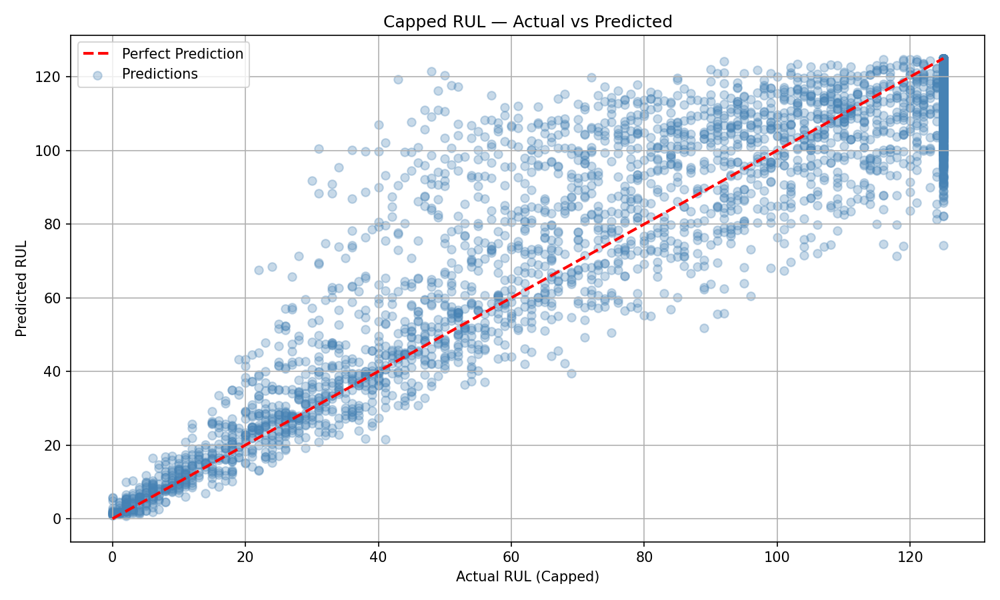
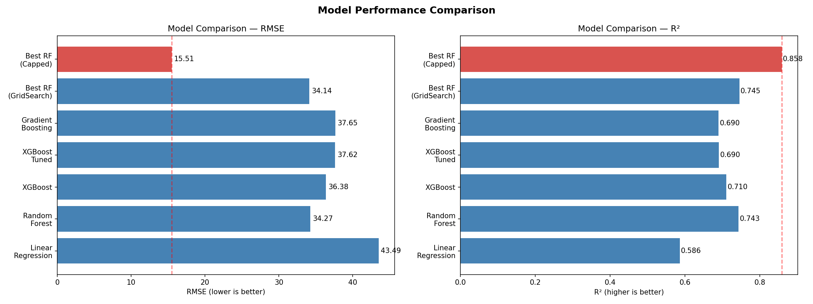
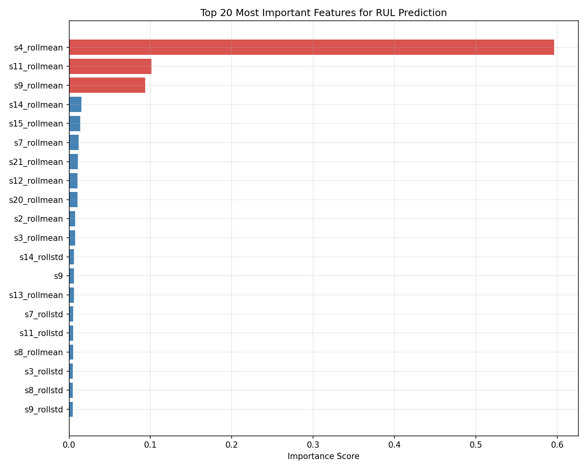
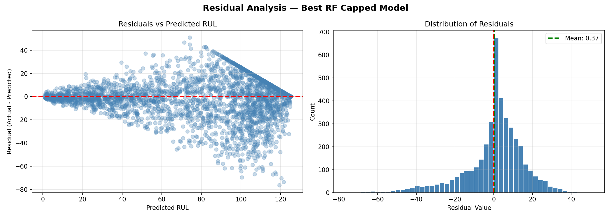
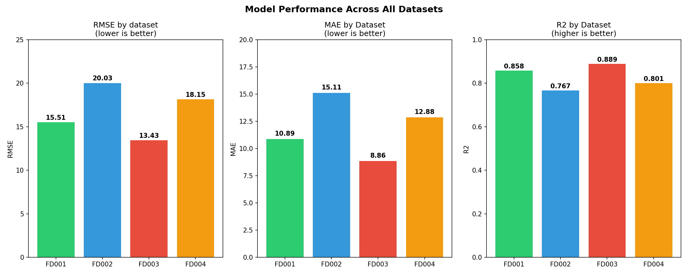
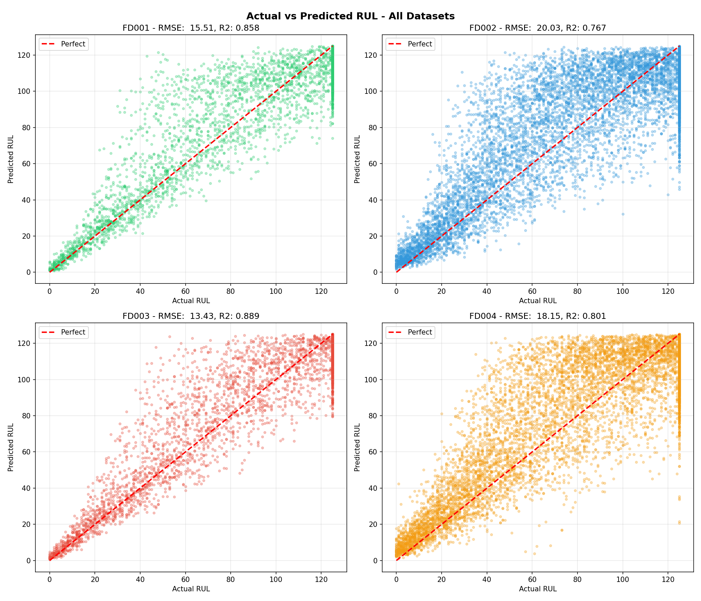

# 🔧 Turbofan Engine Predictive Maintenance
### Predicting Remaining Useful Life (RUL) using NASA CMAPSS Dataset


---

## 📌 Project Overview

This project builds an end-to-end **predictive maintenance system** for turbofan 
aircraft engines using the NASA CMAPSS degradation dataset. The goal is to predict 
the **Remaining Useful Life (RUL)** of an engine — how many cycles it has left 
before failure.

Predictive maintenance is a critical application of machine learning in industrial 
settings, enabling organizations to:
- Reduce unplanned downtime and catastrophic failures
- Optimize maintenance scheduling and reduce costs
- Improve safety in aviation and manufacturing environments

---

## 🎯 Business Context

Unplanned engine failures cost the aviation industry billions annually. Traditional 
**reactive maintenance** (fix when broken) and **preventive maintenance** 
(fix on schedule) are either too late or too early. 

**Predictive maintenance** uses real sensor data to answer: 
> *"When exactly will this engine need maintenance?"*

This project demonstrates how machine learning can answer that question with 
**86% accuracy (R²=0.858)** using only sensor readings.

---

## 📊 Dataset

**Source:** [NASA CMAPSS Turbofan Engine Degradation Dataset](https://www.kaggle.com/datasets/bishals098/nasa-turbofan-engine-degradation-simulation)

**Original Paper:** 
Saxena et al. (2008) — Damage Propagation Modeling for Aircraft Engine 
Run-to-Failure Simulation. PHM08, Denver CO.(https://c3.ndc.nasa.gov/dashlink/static/media/publication/2008_IEEEPHM_CMAPPSDamagePropagation.pdf)

**Operating Condition Details:** 
NASA CMAPSS dataset documentation (readme.txt included in download)

The dataset simulates turbofan engine degradation under different operating 
conditions and fault modes:

| Dataset | Operating Conditions | Fault Modes | Train Size |
|---------|----------------------|-------------|------------|
| FD001   | 1                    | 1           | 20,631     |
| FD002   | 6                    | 1           | 53,759     |
| FD003   | 1                    | 2           | 24,720     |
| FD004   | 6                    | 2           | 61,249     |

Each row represents one engine at one point in time with:
- 1 engine ID
- 1 cycle counter
- 3 operational settings
- 21 sensor readings

**Operating Conditions** refer to the altitude and throttle 
settings under which the engine operates:

| Condition | Alt (ft) |   Mach   | TRA  |
|-----------|----------|----------|------|
|     1     |   35000  |   0.84   |  100 |
|     2     |   20000  |   0.70   |  100 |
|     3     |   10000  |   0.25   |  100 |
|     4     |   0      |   0.00   |  100 |
|     5     |   10000  |   0.42   |  42  |
|     6     |   0      |   0.00   |  0   |

*Alt = Altitude, Mach = Mach Number, TRA = Throttle Resolver Angle*

**Fault Modes** refer to the component experiencing degradation:

| Fault | Component |       Description                    |
|-------|-----------|--------------------------------------|
|   1   |    HPC    | High Pressure Compressor degradation |
|   2   |    Fan    | Fan degradation                      |

> FD001 and FD002 only experience HPC degradation.
> FD003 and FD004 experience both HPC and Fan degradation simultaneously.
---

## 📁 Project Structure
```
turbofan-predictive-maintenance/
│
├── data/
│   ├── raw/                  # Original NASA CMAPSS files
│   └── processed/            # Engineered features, cleaned data
│
├── notebooks/
│   ├── 01_data_exploration.ipynb  # EDA, feature engineering, models
│   ├── 02_sql_pipeline.ipynb      # SQL database pipeline
│   └── 03_multi_dataset_comparison.ipynb  # All 4 datasets comparison
│
├── src/                      # Reusable Python modules
|   ├── api/
│   │   ├── app.py            # Flask API application
│   │   ├── predict.py        # Prediction logic
│   │   └── test_api.py       # API tests 
│   ├── data_loader.py
│   ├── feature_engineering.py
│   └── model.py
|
├── sql/
│   ├── create_tables.sql     # Database schema
│   ├── analysis_queries.sql  # Fleet health queries
│   └── setup_instructions.md
│
├── outputs/
│   ├── figures/              # All visualizations
│   └── models/               # Saved trained models
│
├── requirements.txt
└── README.md
```

---

## 🔬 Methodology

### 1. Exploratory Data Analysis
- Analyzed 100 engines across 20,631 cycles
- Identified sensor degradation trends visually and statistically
- Dropped 7 flat sensors with near-zero variance
- Confirmed 14 sensors with meaningful correlation to RUL

### 2. Feature Engineering
- **Target variable:** Engineered RUL = max_cycle − current_cycle
- **Rolling features:** Added 5-cycle rolling mean and std for all 14 sensors
- **RUL Capping:** Applied cap at 125 cycles based on degradation domain knowledge
- **Normalization:** MinMax scaling to 0-1 range
- Final feature set: 44 features

### 3. Model Building & Selection
Trained and compared 6 models:

| Model | RMSE | MAE | R² |
|-------|------|-----|-----|
| Linear Regression | 43.49 | 33.36 | 0.586 |
| Random Forest | 34.27 | 23.59 | 0.743 |
| XGBoost | 36.38 | 25.76 | 0.710 |
| XGBoost Tuned | 37.62 | 26.80 | 0.690 |
| Gradient Boosting | 37.65 | 26.92 | 0.690 |
| **Best RF (Capped RUL)** | **15.51** | **10.89** | **0.858** |

### 4. Hyperparameter Tuning
- Used GridSearchCV with 3-fold cross validation
- Tested 24 parameter combinations (72 total fits)
- Best parameters: n_estimators=200, max_depth=None

### 5. Multi-Dataset Comparison
Tested model robustness across all 4 datasets:

| Dataset | RMSE  |  MAE  |   R²  | Conditions | Fault Modes |
|---------|-------|-------|-------|------------|-------------|
| FD003   | 13.43 | 8.86  | 0.889 |      1     |      2      |
| FD001   | 15.51 | 10.89 | 0.858 |      1     |      1      |
| FD004   | 18.15 | 12.88 | 0.801 |      6     |      2      |
| FD002   | 20.03 | 15.11 | 0.767 |      6     |      1      |

**Key finding:** Single operating condition datasets (FD001, FD003) 
outperform multi-condition datasets (FD002, FD004), confirming that 
varying operating conditions are more challenging than multiple fault modes.

---

## 📈 Key Results

- **Best Model:** Random Forest with RUL Capping
- **RMSE:** 15.51 cycles
- **MAE:** 10.89 cycles  
- **R²:** 0.858 (explains 86% of RUL variation)
- **Mean Residual:** 0.37 (nearly unbiased predictions)

### Most Important Features
| Rank |  Feature     | Importance |
|------|--------------|------------|
|   1  | s4_rollmean  |    59.6%   |
|   2  | s11_rollmean |    10.1%   |
|   3  | s9_rollmean  |    9.4%    |
|   4  | s14_rollmean |    1.5%    |
|   5  | s15_rollmean |    1.4%    |

### Key Finding
> Rolling mean of sensor s4 alone accounts for **59.6% of prediction importance**, 
> confirming that sustained sensor trends are far more predictive than 
> individual cycle readings.

---

## 📊 Visualizations

### Actual vs Predicted RUL


### Model Comparison


### Feature Importance


### Residual Analysis


### Multi-Dataset Comparison


### All Datasets Predictions

---

## 🚀 How to Run

### 1. Clone the repository
```bash
git clone https://github.com/ghv29/turbofan-predictive-maintenance.git
cd turbofan-predictive-maintenance
```

### 2. Install dependencies
```bash
pip install -r requirements.txt
```

### 3. Download the dataset
Download from [Kaggle](https://www.kaggle.com/datasets/bishals098/nasa-turbofan-engine-degradation-simulation) 
and place files in `data/raw/`

### 4. Set up MySQL Database
- Install MySQL on your machine
- Open MySQL Workbench and run `sql/create_tables.sql` to create the database
- When running `02_sql_pipeline.ipynb` you will be prompted to enter your MySQL password

### 5. Run notebooks in order
```
notebooks/01_data_exploration.ipynb        → EDA, feature engineering, model building
notebooks/02_sql_pipeline.ipynb            → SQL database pipeline  
notebooks/03_multi_dataset_comparison.ipynb → Multi-dataset comparison
```
### 6. Start the API
```bash
python src\api\app.py
```

### 7. Test the API
```bash
python src\api\test_api.py
```

---

## 🌐 API Usage

Start the API:
```bash
python src\api\app.py
```
API runs at `http://127.0.0.1:5000`

| Endpoint | Method | Description |
|---|---|---|
| `/health` | GET | Check API status |
| `/model-info` | GET | Model details & metrics |
| `/predict` | POST | Single engine RUL prediction |
| `/predict/batch` | POST | Multiple engines at once |

**Example response from `/predict`:**
```json
{
  "predicted_RUL": 11.6,
  "health_status": "CRITICAL",
  "message": "Schedule maintenance immediately!",
  "urgency": "Immediate action required"
}
```
> See `src/api/test_api.py` for full request examples.
---

## 🔮 Future Work

- [x] ~~ Deploy model as REST API using Flask
- [ ] Build Tableau dashboard for fleet health monitoring
- [ ] Explore deep learning approaches (LSTM)

---

## 🛠️ Tech Stack

| Tool | Purpose |
|------|---------|
| Python | Core programming |
| Pandas & NumPy | Data manipulation |
| Scikit-learn | ML models & evaluation |
| XGBoost | Gradient boosting |
| Matplotlib & Seaborn | Visualization |
| Flask | REST API deployment |
| MySQL | Database pipeline |
| SQLAlchemy | Python-MySQL connection |
| Jupyter Notebook | Development environment |
| Git & GitHub | Version control |

---

## 👤 Author

Goldie H. Vaghela
MSc International Technology Transfer Management  
BE Mechanical Engineering  
Data Analytics Bootcamp — Ironhack

[](https://github.com/ghv29)
[](www.linkedin.com/in/goldiev)

---

## 📄 License
This project is licensed under the MIT License.